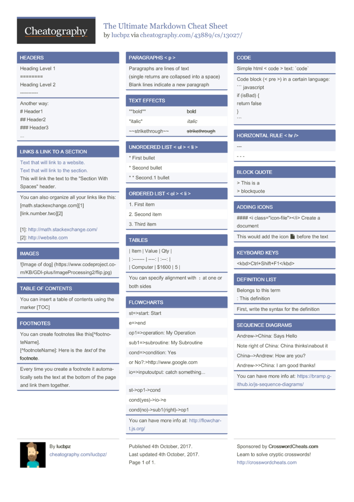

=======
# Uppgift Github

### Föreläsning Github:

#### Git kommandon kännetecknas av att man sätter git framför   och hänvisar till att man arbetar mot github (Versionshanteringskontroll)

| Kommando | Beskrivning | 
| --- | --- |
| *git init* | Skapar ett nytt gip repo (repository) |
| *git status* | Visar status | 
| *git add* | Lägger filen i status staged | 
| *git commit -m ""* | Används för att commita till en förändring |
| *git checkout* | Användsför att hoppa mellan olika bransches och main |

### Egen research Github:

Kikade på denna sidan då jag tyckte den var lätt navigerad och jag gillar att läsa saker steg för steg. https://graphite.dev/guides/git-checkout-main  

| Kommando | Beskrivning | 
| --- | --- | 
| *git pull* | För att hämta nya uppdateringar för filerna från remote till lokal |

### Markdowns:

#### Markdowns är ett bra sätt att ge sina beskrivningar struktur och tydlighet genom att kunna ändra storleken på viss text för att signalera till läsaren att nu kommer ett nytt stycke eller dylikt. jag tycker att https://www.markdownguide.org/basic-syntax/ är en bra hemsida för att lära sig "göra rätt" för att det ska bli tydligt.

>>>>>>> github
