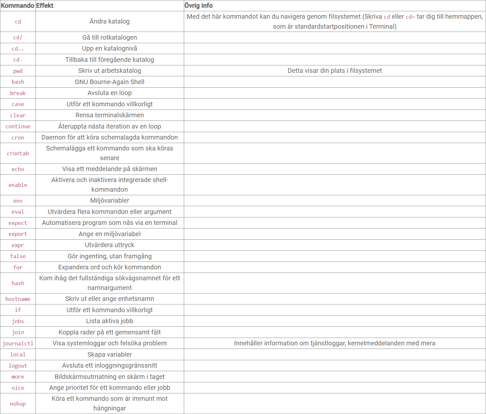

# Uppgift Terminal

#### Föreläsning Github:

###### Git kommandon kännetecknas av att man sätter git framför och hänvisar till att man arbetar mot github (Versionshanteringskontroll)

| ##### Kommando | ##### Beskrivning |
| --- | ---|
| **pwd** | sökvägen till nuvarande katalog |
| **ls -la** | För att se innehållet i mappen, även dola |
| **mkdir** | Skapa ny mapp |
| **cd ..** | Backa ett steg i mapp | 

